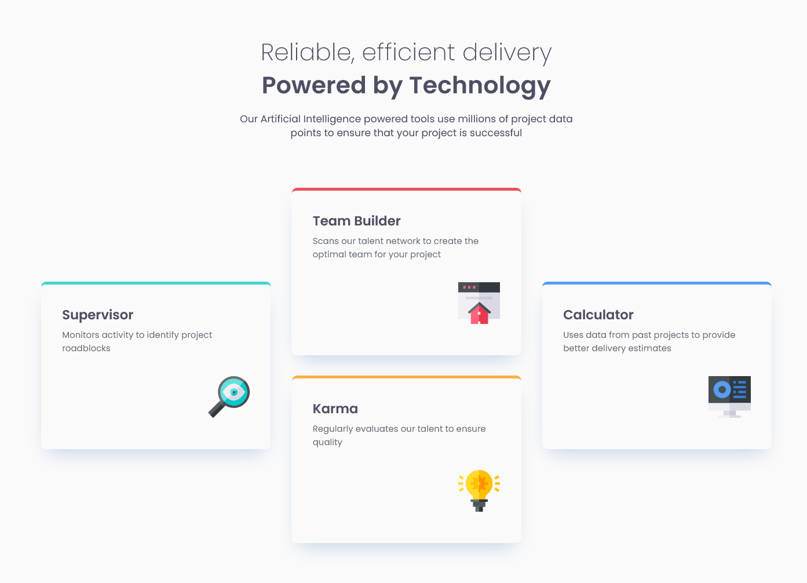

# Frontend Mentor - Four card feature section solution

This is a solution to the [Four card feature section challenge on Frontend Mentor](https://www.frontendmentor.io/challenges/four-card-feature-section-weK1eFYK). 

## Table of contents

- [Overview](#overview)
  - [The challenge](#the-challenge)
  - [Screenshot](#screenshot)
- [My process](#my-process)
  - [Built with](#built-with)
  - [What I learned](#what-i-learned)
  - [Continued development](#continued-development)
  - [Useful resources](#useful-resources)
- [Author](#author)

## Overview

### The challenge

Users should be able to:

- View the optimal layout for the site depending on their device's screen size

### Screenshot

## My process

### Built with

- Semantic HTML5 markup
- CSS custom properties
- Flexbox
- CSS Grid
- Mobile-first workflow

### What I learned

- Container queries
- Change cards layout using Grid

### Continued development

Focus more on implementing fluid typography. I'm still not comfortable with using clamp() for font sizes. I plan to practice to use it more in future projects.  

### Useful resources

- [Demo on Container queries](https://htmlacademy.ru/demos/191#1) - This is a good demo which helped me better understand container queries. I'd recommend it to anyone still learning this concept although it's in Russian.

## Author

- Frontend Mentor - [@natalya87324](https://www.frontendmentor.io/profile/natalya87324)

